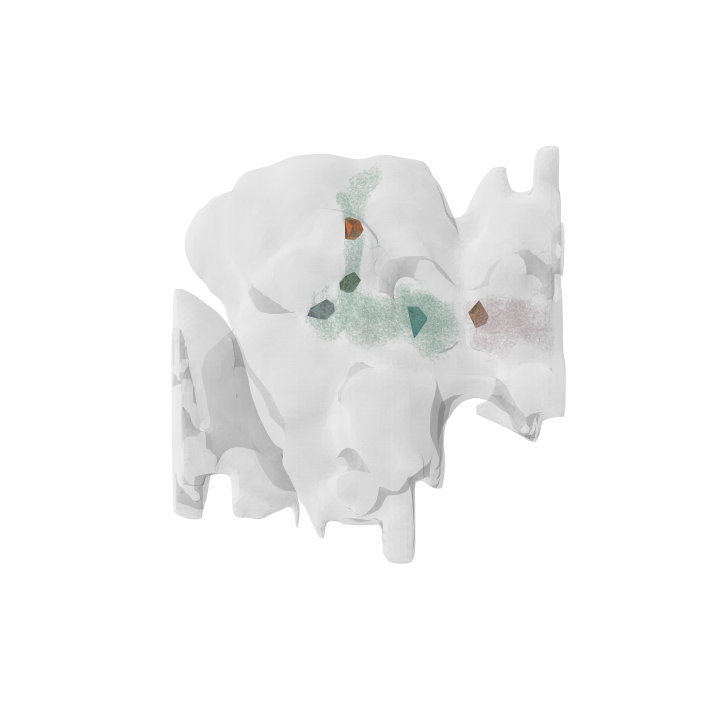

# synapse_neuprint

🚩 **What was the problem?**
Neuronal synapses captured by electron microscopy (EM) are characterized by their dark appearance due to their protein-dense composition. Between two adjacent cells, the presynaptic site forms the T-bar, where clusters of neurotransmitter vesicles accumulate, while the postsynaptic density (PSD), recognizable by its "teeth-like" structure, represents the output. In high-resolution 3D EM images, synapses are often confused with other darkly stained organelles or with artefacts produced by membrane shrinkages, leading to subjective classifications in ground truth annotations. Nevertheless, an AI model is proposed to analyse visual cues and classify synapses in EM images because manual annotation of synapse is both tedious and expensive.

💡**All solutions we explored and why?**
The Janelia Hemibrain dataset is a key resource because it is a FIB-SEM volume at 8nm resolution, which contains annotations of pre- and post- synaptic partners. With neuPrint+ project, wide ranges of features can be extracted and subsequently analysed from this dataset, including the confidence levels (CL) of synapses.:
1. Combinations of ROIs and neurons with the densest populations of synapses is identified, confidence level of synapses is adjusted accordingly 
2. Synapse points were then partitioned into limited-dimensional clusters using KMeans clustering to constrain the bounds. 
3. From these clusters, variations of convex hulls were generated to achieve the smallest volume containing the largest number of points. 
4. Once created and ranked, the optimal convex hull from each cluster were transformed into compact cuboids, with outliers removed based on their distance from the centroid. 
This process produced 3D cubes with smaller, denser regions, minimizing empty space in order to reduce AI computational costs.

🧠 **Logic behind finally choosing the regions in hemibrain for the hulls:**
In neuPrint, two dataframes, `neuron_df` and `roi_counts_df`, are returned when a NeuronCriteria is applied. The `neuron_df` contains information about neuron types and their respective numbers of pre- and post-synapses. However, a single neuron can intersect multiple brain regions which may lead to a widely distributed data. In contrast, the `roi_counts_df` provides synapse counts for each ROI but lacks information about the corresponding neuron types. The `neuron_df` helps identify which neurons have the highest number of synapses, while the `roi_counts_df` allows us to determine the ROIs where these neurons intersect. To address this, we merged both dataframes on body IDs, resulting in a single dataframe that includes both neuron types and ROI information, ranked by per-ROI synapse counts. This approach allows for a composition of ROIs and neurons which ensures unique combinations for coherent analysis.

⭐ **Exploration of synaptic counts**
The `synapse_count` feature allows users to adjust the confidence level (CL) and accurately determine the 3D locations of pre- and post-synaptic partners. Pre-synaptic coordinates were used to create variations of these points for generating the general convex hull. This initial convex hull encapsulates the overall structure and spatial distribution of synapses, providing a comprehensive view. However, the general hull often includes outlier, expanding the volume with unnecessary blank data. To improve this, I generated a second, more compact hull by selectively ranking and refining the hull coordinates. Once the compact hull was constructed, KMeans clustering was applied to the filtered coordinates to form distinct clusters, thereby reducing the dataset size while preserving its structural integrity. The coordinates within each cluster were then used to create new convex hulls, following the same steps as before. This ensures that the hull vertices from each cluster generate the smallest possible volume while enclosing the largest number of synapses.

📦**The Bounding Boxes** Convex hulls from clusters are typically avoided in machine learning models due to their irregular, non-standardized shapes. To overcome this limitation, we first calculated the centroid of the clustered convex hull. Next, the Euclidean distance between each synapse on the hull and the centroid was computed and ranked, with points farther from the centroid identified as potential outliers or boundary points. These distant points were progressively removed in 5% increments, ranging from 5% to 35% of the total points (adjustable). For each trimmed set of points, we recalculated a bounding box, defined by the minimum and maximum coordinates in the x, y, and z dimensions. After refining the bounding box, we evaluated how many original pre-synaptic and post-synaptic points fell within the new boundaries, ensuring that the voxel count remained close to the target range of 1500. The optimal percentage of points to remove was determined by balancing the retention of a significant number of synapses while acheivieng a compact bounding box. 

👁️**Visualisation using navis and neuprint.** Navis library was used for rendering hemibrain templates and mapping existing synaptic data. Neuron skeletons were retrieved using Neuprint, and visualized in 3D using the `navis.plot3d() function`, allowing a display of both the neuron skeletons and the convex hulls of synaptic clusters alongside the hemibrain template. We discovered that the hemibrain was inverted when loaded, so the `navis.mirror_brain()` function allow properly align the brain and hull meshes along the Z-axis. The final 3D visualization gave a detailed view of the spatial structure of neurons and synaptic regions within the brain. _See .html files in figures_

🪞**Mirror/flipping hack for navis template brains.** `navis.mirror_brain()` is restricted to specific data types and cannot be directly applied to brain templates. As an alternative method,  the original vertices and faces from the volume mesh from the brain template is extracted. To achieve the desired anatomical orientation, we constructed a rotation matrix for reflection across the Z-axis and defined additional rotation matrices for reflections across the XY-plane and YZ-plane. This approach can potentially be adapted for other mesh volumes if an orientation adjustments is required.

- **Visualisation shows the neuron structures and convex hulls mapped to the hemibrain**

[Download to interact with the 3D visualization](https://github.com/shiyanlee/synapse_neuprint/blob/main/figures/htmls/interactive_brain%26hull_3d.html)

